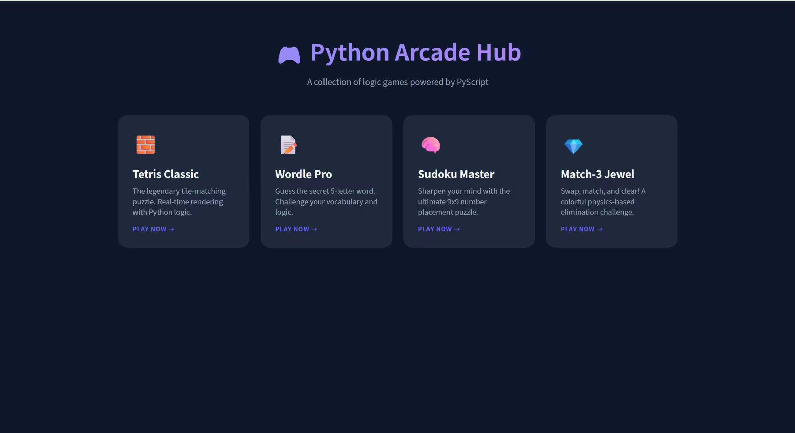
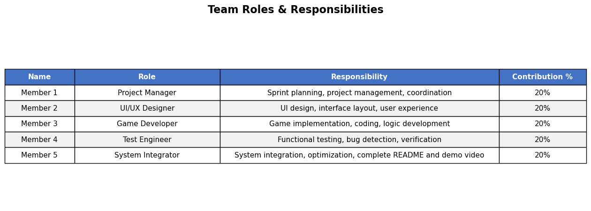
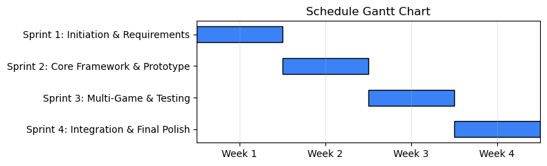

#Graphical Abstract

#Purpose of the software
This project is a lightweight mini-game collection designed for daily fragmented-time leisure and entertainment. It helps users relax, exercise logical thinking, improve concentration, and expand vocabulary in an easy and accessible way.
(1) Software Development Process: 
This project follows the Agile Model.
(2) Reason:
We chose Agile as our software development process for these reasons:
1.Flexibility: Easy to adapt to new ideas, bug fixes, and user feedback during development.
2.Team collaboration: Clear role division and short sprint cycles improve efficiency.
3.User-centric: Early demoable versions let us validate usability early.
Since our project contains four independent mini-games, Agile allows us to develop, test, and adjust each game separately, which is much more efficient than the rigid and fixed Waterfall model.
(3) Possible usage of software (Target Market)：
This game collection is used for leisure and entertainment in fragmented daily time. It targets students, office workers, and users of all ages who seek a convenient way to relax, exercise logical thinking, enhance concentration, and expand vocabulary while easily killing time. It serves as a lightweight, accessible casual gaming solution suitable for short breaks, commutes, waiting periods, and other free moments, filling a practical demand in the market for low threshold, brain engaging entertainment that balances fun and cognitive exercise without requiring long term commitment or heavy hardware resources.
#Software Development Plan
(1) Development process:
1. Sprint planning:
During the sprint planning stage, we confirmed the four-game lineup of our mini-game collection, including Tetris, Wordle, Sudoku, and Match-3, and clearly defined the core gameplay functions and interactive rules for each game. We also determined the technical architecture and selected PyScript as the core framework to support Python code running directly in the browser, and set clear, achievable development objectives and task scope for each sprint to ensure efficient and targeted progress of the whole project.
2. Design:
In the design stage, we created a unified dark-themed main hub interface that serves as the unified entry for the entire game collection, completed a clear and user-friendly game card layout, designed a smooth and intuitive cross-game navigation flow, and carried out independent and complete logic design for each puzzle game to ensure stable operation and consistent user experience.
3. Implementation: 
During the implementation stage, we built the complete homepage menu and interactive portal, independently coded the Python-based game logic for each of the four mini-games to realize core functions such as operation, judgment and scoring, and integrated front-end styling, click interaction effects and game launch routing to support one-click start and normal operation of each game.
4. Testing: 
In the testing stage, we verified the functional accuracy and logical correctness of all games, fixed various compatibility problems under different mainstream browsers, tested the stability and fluency of the main menu and navigation system, and optimized the overall ease of use to adapt to casual quick-play scenarios in fragmented time.
5. Review & retrospective: 
During the review and retrospective stage, we demonstrated the usable build version at the end of each sprint, collected comprehensive internal testing feedback and experience suggestions, and adjusted the game balance, UI details, interaction response and logical parameters in a targeted manner to continuously improve product quality and user experience.
6. Final integration: 
In the final integration stage, we combined all four independent mini-games into a unified launcher platform, completed the unified design and interaction optimization of the main menu, realized stable and smooth cross-game navigation and switching, and ensured the overall consistency and operational stability of the entire game collection system.
7. Documentation & video: Complete README and demo video.
(2) Members (Roles & Responsibilities & Portion):

(3) Schedule:
1. Week 1 – Sprint 1: Project Initiation & Requirement Analysis
Complete project topic confirmation, requirement analysis, and Agile development framework setup. Define game functions, technical architecture, and team task allocation. Finalize development environment, library selection, GitHub repository setup, and initial design draft.
2. Week 2 – Sprint 2: Core Framework & Prototype Development
Develop the main program framework, menu system, and basic interaction logic. Implement the first mini‑game prototype, conduct unit testing, and complete iterative debugging. Output a runnable demo version for internal review.
3. Week 3 – Sprint 3: Multi‑Game Implementation & Functional Testing
Develop all remaining mini‑games, integrate them into the main system, and unify UI style. Perform functional testing, usability testing, bug fixing, and logic optimization. Complete core algorithm verification and stability improvement.
4. Week 4 – Sprint 4: Integration & Final Optimization
Complete full system integration, test cross-game navigation, adjust user experience, optimize performance, and finalize all game functions to ensure stable operation. Write complete README documentation, record and edit the demo video.

(4) Algorithm:
1. Sudoku Algorithm:
Backtracking: A recursive depth-first search that builds a valid grid and ensures the puzzle has a solution.
Constraint Checking: Real-time validation verifying row, column, and 3x3 box uniqueness (1-9).
Randomization: Shuffle-based cell selection to ensure unique puzzle layouts every game.
2. Tetris Algorithm:
3.  Collision Detection: Checks grid boundaries and occupied cells to prevent blocks from overlapping or exiting the playfield.
Matrix Manipulation: Uses 2D arrays to track the board state and performs 90° matrix rotations for block movement.
Line Clearing: Scans the 2D grid after each placement; if a row is fully occupied, it is deleted and all rows above shift downward.
4. Wordle (Word Guess) Algorithm:
Character Comparison: A two-pass matching process: Identifies exact matches (Green); Identifies character existence in wrong positions (Yellow) while tracking frequency.
Letter Frequency Logic: Prevents duplicate hints for the same letter if the count exceeds the target word's frequency.
Dictionary Filtering: Uses a random index selector to pull a 5-letter target from a pre-defined word array.
(5) Current Status:
All planned mini-games are fully implemented and runnable.
Unified main menu and navigation are complete.
Basic testing and bug fixing finished.
All game control logic, scoring systems, and user interactions run stably.
System integration between the main platform and all games works reliably.
User interface design is consistent, clear, and user-friendly.
(6) Future Plan:
Add more mini-game types.
Implement leaderboard and local save.
Optimize UI for mobile/responsive layout.
Add sound effects and background music.
Support multiple languages
# Demo Video
You Tube URL : [ ]
# Environment
(1) Programming Language: Python 3.11+ & HTML5/CSS3
(2) Framework/Libraries: PyScript (Core.js), Standard Random Library
(3) Minimum Hardware Requirements: Dual-core CPU, 2GB RAM, 1024x768 Display
(4) Minimum Software Requirements: Modern Web Browser (Chrome/Edge/Firefox/Safari) with WebAssembly support
# Declaration
Originality: Original implementation using Python logic in a web environment.
AI Usage: UI/UX and logic optimization assisted by AI (Gemini).
License: Open for educational and non-commercial use.
